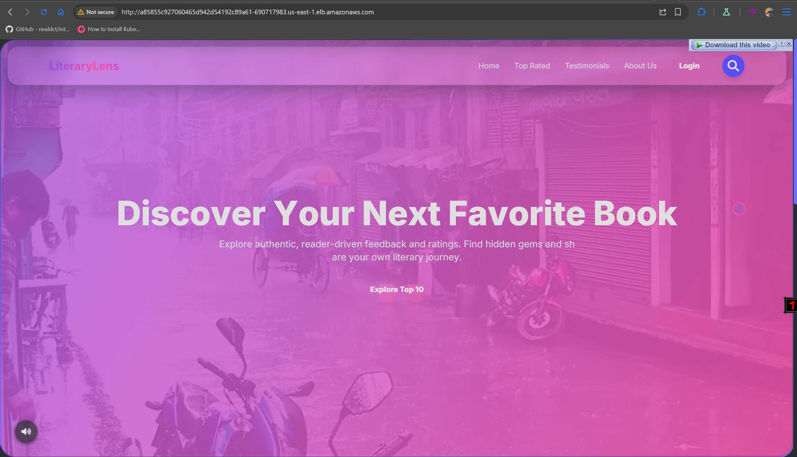
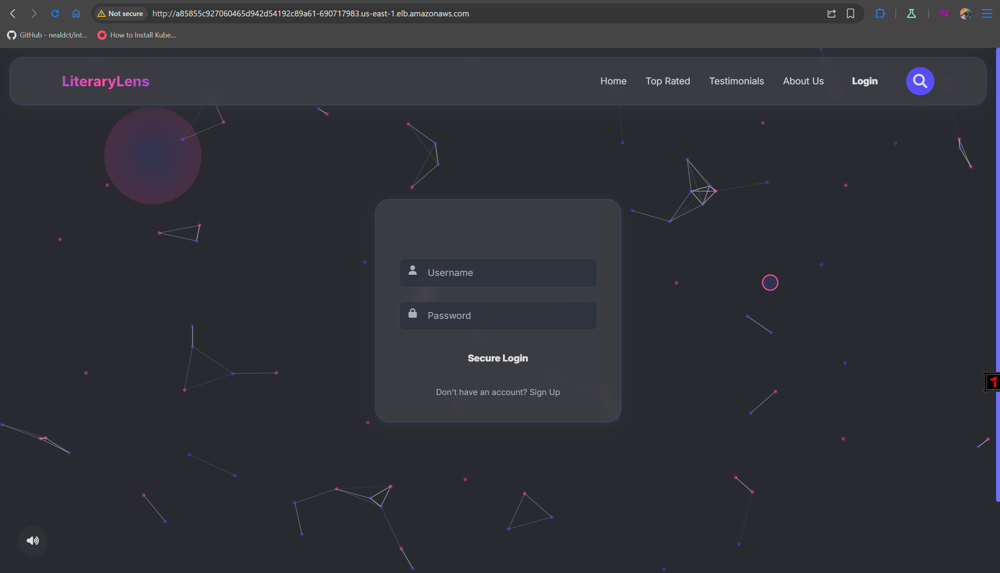
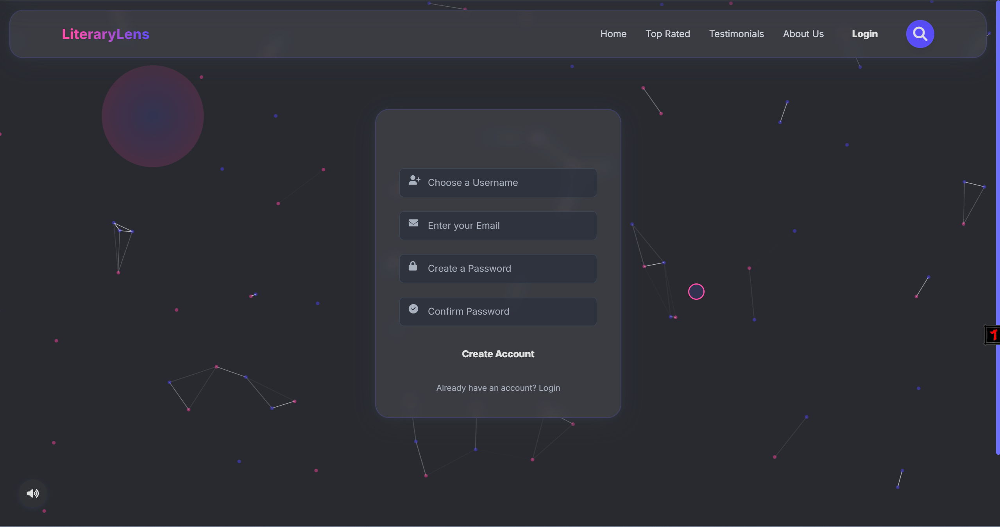
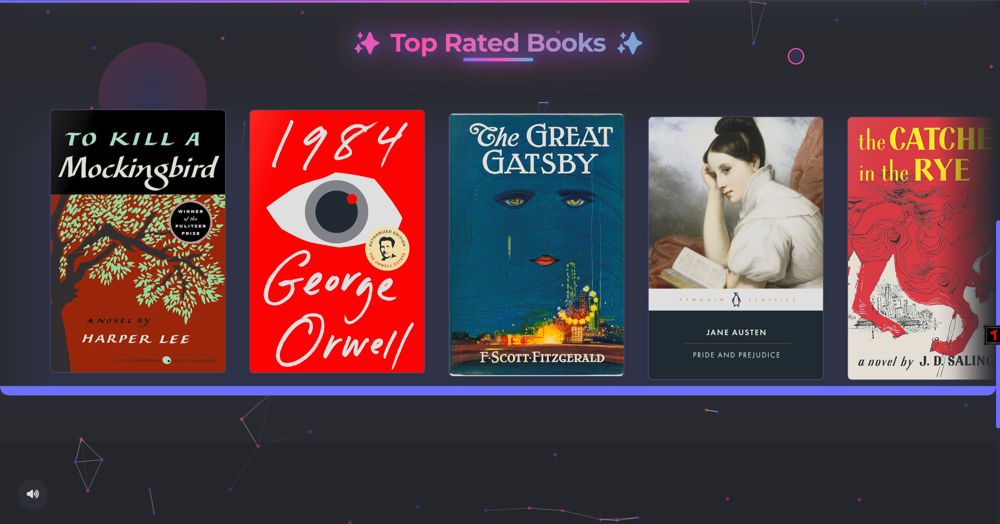
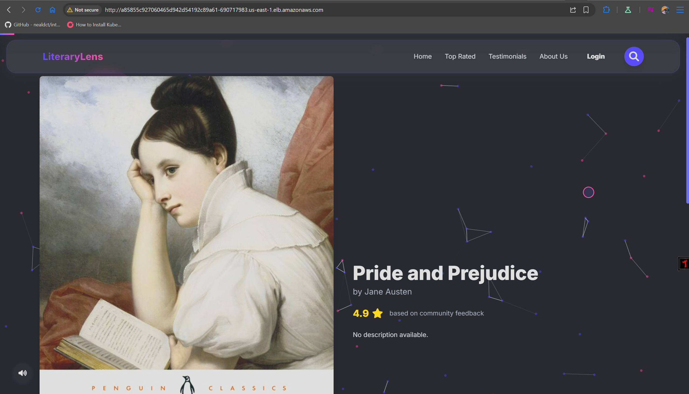
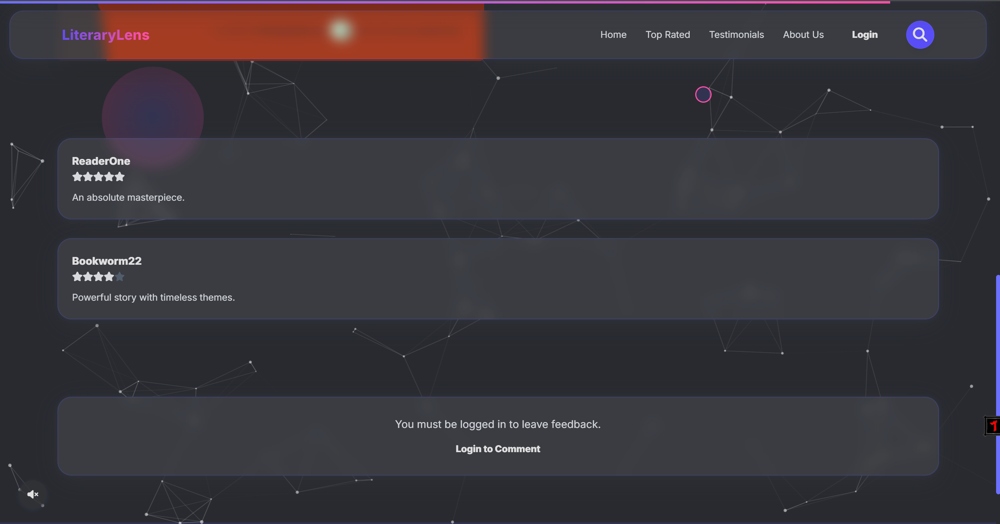

# 📚 LiteraryLens

**LiteraryLens** is a modern, community-driven web application for discovering, reviewing, and rating books. It features a beautiful UI, interactive book cards, user authentication, and real-time feedback—all built with Node.js, Express, and a rich HTML/CSS/JS frontend.

---

## ✨ Features

- 🏆 Browse top-rated books with interactive cards and smooth transitions
- ✍️ Leave ratings and feedback (requires login)
- 📝 Edit or delete your own comments
- 🎨 Modern, responsive design with glassmorphism and animated effects
- 🔍 Live search with instant results
- 👤 User authentication (signup/login/logout)
- 💬 Testimonials and About page

---






## 🗂️ Project Structure

```
LiteraryLens/
├── app.js                # Express server
├── public/
│   ├── index.html        # Main frontend (SPA)
│   ├── images/           # Book cover images
│   └── ...               # CSS, JS, assets
└── README.md             # Project documentation
```

---

## 🚀 Getting Started

### Prerequisites

- [Node.js](https://nodejs.org/) (v14 or newer recommended)
- [npm](https://www.npmjs.com/)

### Installation

1. **Clone the repository:**  
   ```bash
   git clone <your-repo-url>
   cd LiteraryLens
   ```

2. **Install dependencies:**  
   ```bash
   npm install
   ```

3. **Add book cover images:**  
   - Place book cover images in `public/images/` as referenced in `index.html`.

---

## ▶️ Running the App

Start the server:

```bash
node app.js
```

The app will be available at [http://localhost:3000](http://localhost:3000).

---

## 📝 Usage

- Browse the homepage for top-rated books.
- Click a book card to view details and community feedback.
- Sign up or log in to leave your own feedback.
- Use the search button (🔍) in the navbar for instant book search.

---

## 🛠️ Customization

- To add more books, edit the `books` array in `public/index.html`.
- User data and comments are stored in-memory for demo purposes. For production, integrate a database.

---


**Enjoy discovering and sharing your favorite books with LiteraryLens!** 🚀📖✨
